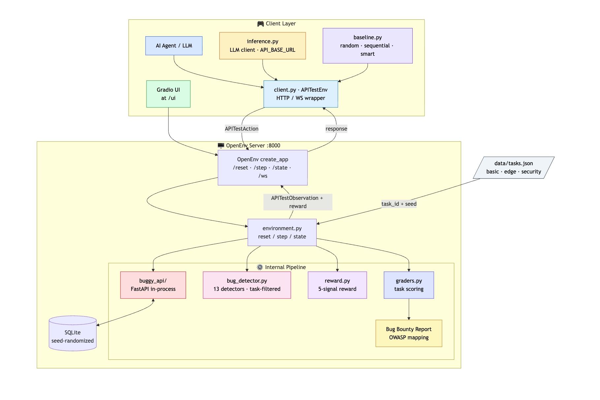
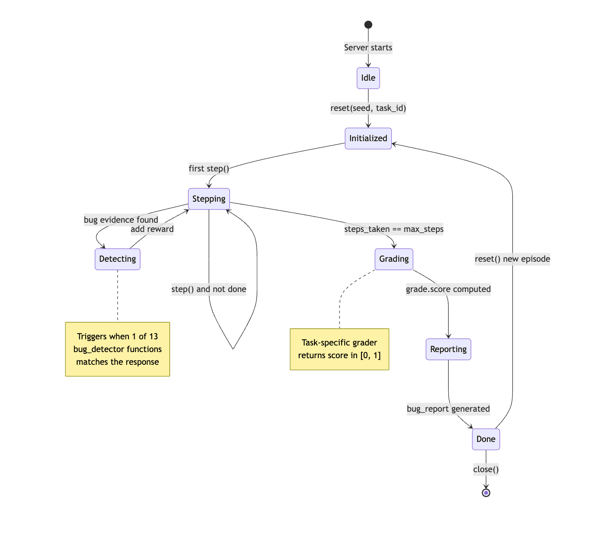
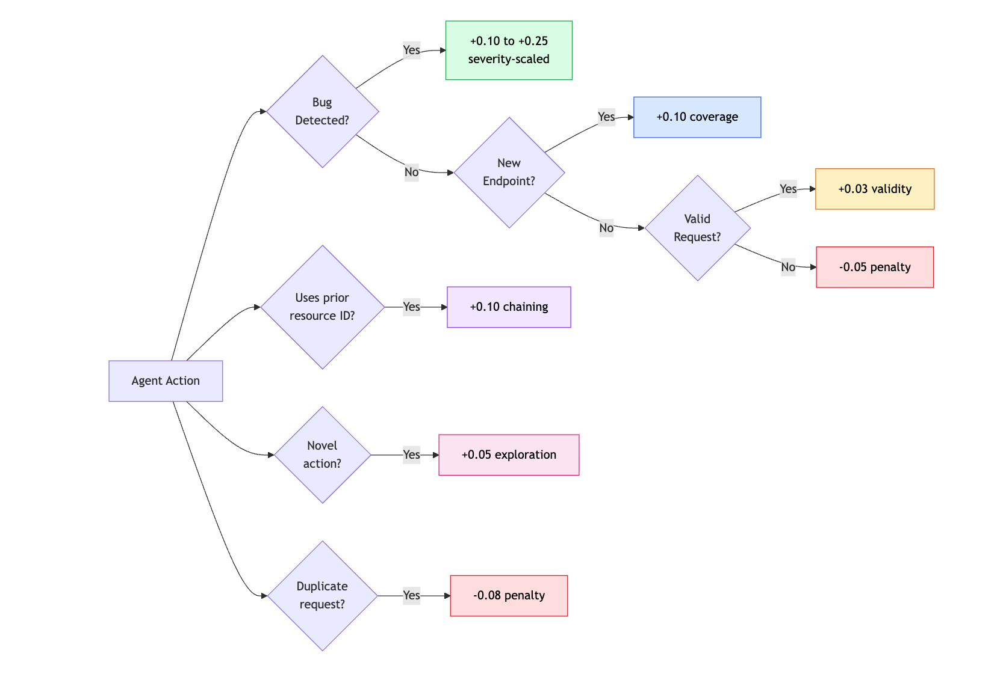
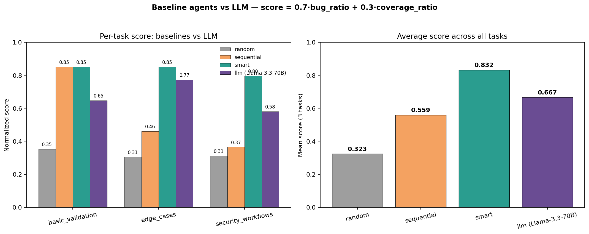

<h1 align="center">API Testing Environment for OpenEnv</h1>

<p align="center">
  <em>An RL environment that teaches AI agents to find real vulnerabilities in REST APIs.<br/>Real bugs. Real reward signal. Verifiable end to end.</em>
</p>

<p align="center">
  <a href="https://huggingface.co/spaces/Mayank022/api-testing-env"><b>Try the live demo →</b></a>
</p>

<p align="center">
  <a href="#overview">Overview</a> ·
  <a href="#architecture">Architecture</a> ·
  <a href="#episode-lifecycle">Lifecycle</a> ·
  <a href="#reward-function">Reward</a> ·
  <a href="#owasp-coverage">OWASP</a> ·
  <a href="#setup--usage">Setup</a> ·
  <a href="#evaluation-results">Results</a>
</p>

<p align="center">
  
</p>

---

## Overview

The agent connects to a deliberately buggy Task Management API, sends HTTP requests, and earns rewards for hitting endpoints, validating responses, and discovering planted vulnerabilities mapped to the **OWASP API Security Top 10**. At the end of every episode the environment auto-generates a structured bug bounty report.

- **13 planted vulnerabilities** across 6 OWASP categories
- **3 difficulty tiers** — `basic_validation` → `edge_cases` → `security_workflows`
- **5-signal reward function** — verifiable, no LLM judge
- **Three attach modes** — in-process Python, Docker container, or deployed HF Space

---

## Why this exists

- Every team ships APIs and every API has bugs.
- The standard tooling (Postman, Schemathesis, OWASP ZAP) needs humans writing tests by hand or falls back to brute-force fuzzing.
- Recent academic work shows RL beats both — *APIRL* (AAAI 2025), *ARAT-RL* (IEEE/ACM 2023) — but until now there was no standard RL benchmark for API security testing.

This environment fills that gap. It gives an agent a real REST API to attack, a deterministic reward signal, and a structured grading rubric — all the ingredients you need to train policies that generalize.

---

## Architecture

The environment is a single FastAPI process (see the diagram at the top of this README) that wraps three things behind the OpenEnv `step()` / `reset()` / `state()` contract:

1. **`buggy_api/`** — an in-process Task Management REST API with seed-randomized data. Every `reset(seed=N)` produces a unique database (different users, tasks, ownership), so agents can't memorize answers between episodes.
2. **`bug_detector.py`** — 13 deterministic detectors, one per planted vulnerability. Each one scans the request/response pair and either fires (bug found) or stays silent. No LLM judge.
3. **`reward.py` + `graders.py`** — combine a 5-signal step reward with a per-task terminal grader. The terminal grader returns a normalized score in `[0, 1]` and a structured OWASP report.

Clients can attach in three ways: in-process from Python, against a Docker container (`IMAGE_NAME=api-testing-env:latest`), or against a deployed HuggingFace Space (`ENV_BASE_URL=https://...`). Same `client.py` for all three.

---

## Episode lifecycle

<p align="center">
  
</p>

A typical episode walks through five states:

| State | Trigger | What happens |
|---|---|---|
| **Idle** | Server boots | Waiting for a `reset()` call |
| **Initialized** | `reset(seed, task_id)` | Database reseeded, task loaded, action history cleared |
| **Stepping** | `step(action)` | Agent sends an HTTP request; observation + step reward returned |
| **Detecting** | Bug detector matches | Reward bumped by severity (easy 0.10 / medium 0.15 / hard 0.25), bug ID logged |
| **Grading** | `steps_taken == max_steps` | Task-specific grader produces a terminal score in `[0, 1]` |
| **Reporting** | Grading complete | Structured bug bounty report attached to the final observation |
| **Done** | Episode closed | Ready for the next `reset()` |

The state machine is the same for every task — only `max_steps`, the seed, and the grader change.

---

## Reward function

<p align="center">
  
</p>

Every step the agent takes is run through a decision tree that produces a partial reward in roughly `[-0.08, +0.30]`:

| Signal | Range | Triggered when |
|---|---|---|
| **Bug discovery** | `+0.10` / `+0.15` / `+0.25` | A planted bug detector fires, scaled by severity |
| **Coverage** | `+0.10` per first hit | The agent reaches a new endpoint for the first time |
| **Validity** | `+0.03` / `+0.10` chaining | The request is well-formed; chaining ID from a prior response gets a bonus |
| **Exploration** | `+0.05` | The action pattern (method + endpoint shape + auth state) is novel |
| **Penalty (duplicate)** | `−0.08` | The agent re-issued an exact duplicate request |
| **Penalty (malformed)** | `−0.05` | The request is structurally invalid |

When the episode ends, the per-task grader adds a terminal score in `[0, 1]` based on its own criteria — CRUD coverage, dependency chaining, security probing — and emits the final OWASP bug bounty report.

The whole pipeline is **verifiable**: no LLM-as-judge, no soft heuristics, no ambiguity. Every signal maps to a real OWASP category that judges can audit.

---

## OWASP coverage

All 13 bugs are mapped to the OWASP API Security Top 10 (2023):

| OWASP Category | Bugs | Description |
|---|---|---|
| **API1** Broken Object Level Authorization | `BUG_TASK_07`, `BUG_AUTH_01` | Users can access/modify other users' resources |
| **API2** Broken Authentication | `BUG_AUTH_02` | Login succeeds with empty password |
| **API3** Broken Object Property Level Auth | `BUG_USER_02` | Response exposes `password_hash` field |
| **API4** Unrestricted Resource Consumption | `BUG_TASK_06`, `BUG_TASK_08` | No pagination cap, long input crashes server |
| **API8** Security Misconfiguration | `BUG_TASK_01-05`, `BUG_TASK_09`, `BUG_USER_01` | Wrong status codes, missing validation, stored injection |

### Full bug registry

| ID | Severity | OWASP | Description |
|---|---|---|---|
| `BUG_TASK_01` | Easy | API8 | `GET /tasks/{id}` returns `200 + null` for missing task (should be `404`) |
| `BUG_TASK_02` | Easy | API8 | `POST /tasks` without title returns `500` (should be `400`) |
| `BUG_TASK_03` | Easy | API8 | `GET /tasks?page=-1` returns `200` (should be `400`) |
| `BUG_TASK_04` | Medium | API8 | `PUT` accepts invalid email format without validation |
| `BUG_TASK_05` | Medium | API8 | `DELETE` returns `200` for non-existent task (should be `404`) |
| `BUG_TASK_06` | Medium | API4 | No pagination cap — `limit=999999` accepted |
| `BUG_USER_01` | Medium | API8 | `POST /users` accepts invalid email |
| `BUG_USER_02` | Medium | API3 | `POST /users` response exposes `password_hash` |
| `BUG_AUTH_02` | Medium | API2 | Login with empty password succeeds |
| `BUG_TASK_07` | Hard | API1 | BOLA — any user can access any task (no ownership check) |
| `BUG_TASK_08` | Hard | API4 | Long title (>5000 chars) crashes server with `500` |
| `BUG_TASK_09` | Hard | API8 | SQL injection payload stored verbatim |
| `BUG_AUTH_01` | Hard | API1 | User A's token can modify User B's tasks |

---

## Tasks

| Task | Difficulty | Steps | Bugs | Focus |
|---|---|---|---|---|
| `basic_validation` | Easy | 25 | 3 | CRUD testing, status code verification |
| `edge_cases` | Medium | 35 | 9 | Invalid inputs, boundary values, ID chaining |
| `security_workflows` | Hard | 45 | 13 | BOLA, auth bypass, injection, state consistency |

---

## Bug bounty report

At episode end the environment emits a structured report:

```
## API Security Assessment Report

**Vulnerabilities Found:** 3
**Critical/Hard:** 0 | **Medium:** 1 | **Low/Easy:** 2

### MEDIUM: Login with empty password succeeds
- ID:           BUG_AUTH_02
- OWASP:        API2:2023 Broken Authentication
- Recommendation: Validate password is non-empty and verify against the stored hash

### LOW: GET /tasks/{id} returns 200 with null for non-existent task
- ID:           BUG_TASK_01
- OWASP:        API8:2023 Security Misconfiguration
- Recommendation: Return 404 Not Found for non-existent resources
```

The report is part of the final observation, so any downstream pipeline (a research notebook, a CI bot, a dashboard) can consume it without re-parsing logs.

---

## Setup & usage

### Local development

```bash
cd api_testing_env
uv sync                                      # or: pip install -e .

# Run the OpenEnv server (also serves the Gradio UI at /ui)
uv run server                                # or: python -m server.app
# → http://localhost:8000/         API root + endpoint catalogue
# → http://localhost:8000/ui       Interactive bug-hunting playground
# → http://localhost:8000/docs     OpenAPI / Swagger
# → http://localhost:8000/reset    POST endpoint hit by graders
```

### Docker

```bash
docker build -t api-testing-env .
docker run -p 8000:8000 api-testing-env
curl -X POST http://localhost:8000/reset -H 'Content-Type: application/json' -d '{}'
```

### Inference (`inference.py`) 

The script runs to evaluate this environment. It uses an OpenAI-compatible client, makes **one LLM call per task** in plan mode, executes the returned JSON action plan against the env, and emits the mandatory `[START] / [STEP] / [END]` log lines.

| Variable | Purpose |
|---|---|
| `API_BASE_URL` | OpenAI-compatible LLM endpoint (default: HuggingFace router) |
| `MODEL_NAME` | Model identifier to use for inference |
| `HF_TOKEN` | HuggingFace token (used as API key) |

```bash
# (a) In-process — default, fastest, no Docker
API_BASE_URL=https://router.huggingface.co/v1 \
MODEL_NAME=meta-llama/Llama-3.3-70B-Instruct \
HF_TOKEN=hf_xxxxxxxxxxxxxxxxxxxxxxxxxxxxxxxx \
python inference.py

# (b) Against a built Docker image
IMAGE_NAME=api-testing-env:latest \
HF_TOKEN=hf_xxx \
python inference.py

# (c) Against a deployed HuggingFace Space
ENV_BASE_URL=https://Mayank022-api-testing-env.hf.space \
HF_TOKEN=hf_xxx \
python inference.py
```

#### Mandatory output format (parsed by the OpenEnv judge)

```
[START] task=basic_validation env=api_testing_env model=meta-llama/Llama-3.3-70B-Instruct
[STEP]  step=1 action=GET_/tasks reward=0.33 done=false error=null
[STEP]  step=2 action=POST_/tasks reward=0.28 done=false error=null
...
[END]   success=true steps=21 score=0.82 rewards=0.33,0.28,...
```

Each per-task `score` is normalized to `[0, 1]` as `0.7 * (bugs_found / total_bugs) + 0.3 * (coverage_pct / 100)`. Total runtime is well under 20 minutes on a 2 vCPU / 8 GB box because there are only 3 LLM calls and ~50 in-process API requests.

### Deploy to HuggingFace Spaces

```bash
huggingface-cli login                # or: hf auth login
openenv push --repo-id your-username/api-testing-env

# Validate after deploy
curl -X POST https://your-username-api-testing-env.hf.space/reset \
     -H 'Content-Type: application/json' -d '{}'
# expected: HTTP 200 with the initial observation JSON
```

---

## Evaluation results

We ran the environment against **5 different agents** to confirm the reward signal is meaningful, varied, and learnable. All numbers are reproducible with `seed=9999`, in-process env mode, plan-based action generation.

<p align="center">
  
</p>

The chart compares three heuristic baselines (`random`, `sequential`, `smart`) against an LLM agent (Llama 3.3 70B via the HuggingFace Inference Router) across all three tasks. The score is the same `[0, 1]` normalization used by `inference.py`: `0.7 · bug_ratio + 0.3 · coverage_ratio`.

| Agent | basic_validation | edge_cases | security_workflows | **Average** |
|---|---|---|---|---|
| `random` (lower bound) | 0.35 | 0.31 | 0.31 | **0.323** |
| `sequential` (fixed plan) | 0.65 | 0.46 | 0.57 | **0.559** |
| `smart` (200-line heuristic) | **0.85** | 0.89 | **0.77** | **0.832** |
| `llm` Llama 3.3 70B | 0.85 | 0.65 | 0.58 | **0.667** |

**What the spread means**

- The **5x gap** between random (0.32) and smart (0.83) proves the reward function is dense enough to distinguish agent skill.
- The smart agent is a 200-line hand-coded heuristic that targets each of the 13 bugs by ID — it's the upper bound a human expert can hand-craft.
- Llama 3.3 70B beats sequential by a wide margin without seeing any task-specific code, showing the environment is *legible* to a general-purpose LLM.
- The gap between Llama (0.67) and smart (0.83) is the headroom a more capable agent is supposed to close.

The **environment is the dataset.** Each `reset(seed=N)` produces a unique database (different users, tasks, ownership), so agents can't memorize — they have to read the API spec and reason about what to attack.

---

## Project structure

```
api_testing_env/
├── inference.py                 # SUBMISSION ENTRY POINT — OpenAI client, [START]/[STEP]/[END]
├── models.py                    # APITestAction, APITestObservation, APITestState
├── client.py                    # EnvClient subclass
├── openenv.yaml                 # OpenEnv manifest
├── pyproject.toml               # Dependencies (incl. openai, gradio)
├── Dockerfile                   # Container for HuggingFace Spaces
│
├── server/                      # ENVIRONMENT (OpenEnv core)
│   ├── app.py                   #   FastAPI server (create_app)
│   ├── environment.py           #   reset() / step() / state()
│   ├── bug_detector.py          #   13 OWASP-labeled bug detectors
│   ├── reward.py                #   5-signal reward computation
│   ├── graders.py               #   Task scoring + bug bounty report
│   └── buggy_api/               #   The deliberately buggy REST API
│       ├── main.py              #     FastAPI app factory
│       ├── database.py          #     In-memory SQLite (seed-randomized)
│       ├── models.py            #     Pydantic schemas
│       └── routes/              #     tasks.py, users.py, auth.py
│
├── plots/                       # Figures used in this README
│   ├── environment_architecture.png
│   ├── environment_state_machine.png
│   ├── reward_signal_function.png
│   └── baseline_comparison_matplotlib.png
│
├── gradio_app.py                # Interactive UI dashboard (mounted at /ui/)
└── data/tasks.json              # Task definitions + bug registry
```

---

## References

- [OWASP API Security Top 10 (2023)](https://owasp.org/API-Security/)
- [APIRL: Deep RL for REST API Fuzzing (AAAI 2025)](https://arxiv.org/abs/2412.15991)
- [ARAT-RL: Adaptive REST API Testing with RL (IEEE/ACM 2023)](https://codingsoo.github.io/publication/2024-adaptive-rest-api-testing-rl)
- [OpenEnv Framework](https://meta-pytorch.org/OpenEnv/index.html)
